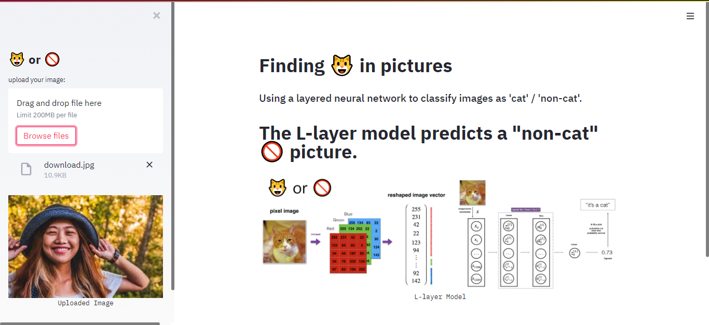
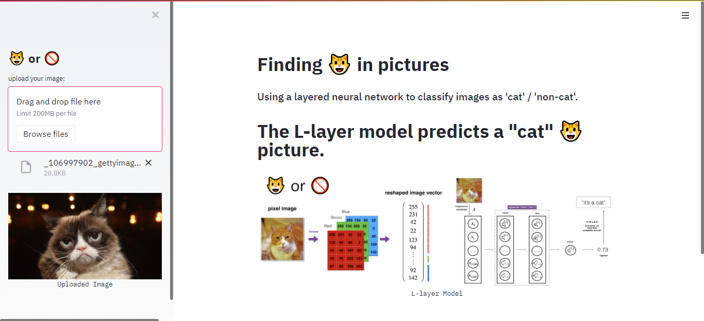

# Deploy to Heroku App

 An interactive application to ... identify 🐱 in images (neural network of l-layers).

 ## Objective

Through a previously constructed l-layer neural network model, a simple application was developed to show how it is possible to launch a Machine Learning or Deep Learning algorithm in a real application. The application is merely illustrative, the main purpose of this repository is to show people who are starting a career in the field of artificial intelligence, in a simple way, how a model can be launched for the testing community.

 ## Model Idea

 The model consists of a series of images that contain cats and others that do not. Thus, from new images that the user chooses, it is possible to use the parameters found in the trained algorithm to classify new images as 'cat'/'non-cat'.

 ## Implementation details

 The entire algorithm was made based on the series of courses seen on Coursera, made available by [deeplearning.ai](https://www.deeplearning.ai/). To build the application, a python package called [streamlit](https://www.streamlit.io/) was used.

 ## Clone the repository

 To clone this repository on your local machine, enter the following command:

 ```
 git clone https://github.com/Alyssonmach/deploy-to-heroku-app.git
 ```

## Run the application on a local server

To run the application locally, type the following command in your terminal:

```
streamlit run streamlit_app.py
```

## Example of use




## Contact me

- [Send me a email](mailto:alysson.barbosa@ee.ufcg.edu.br)